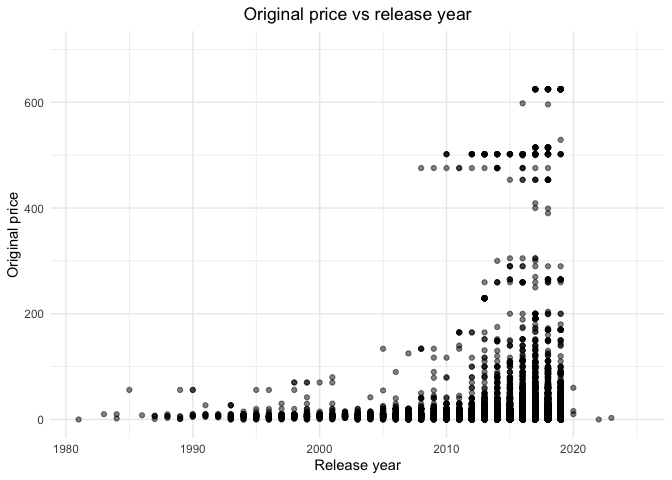
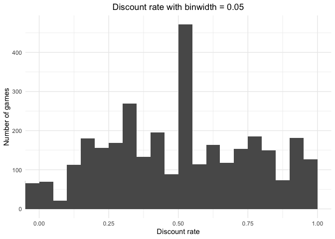
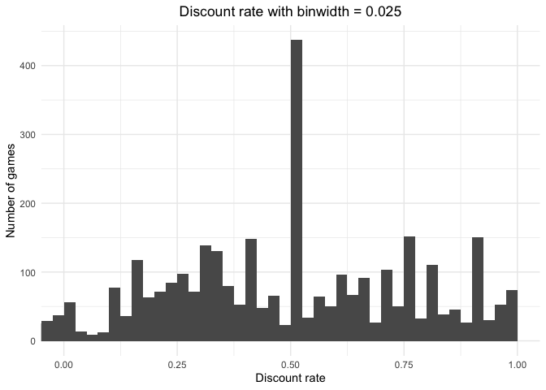
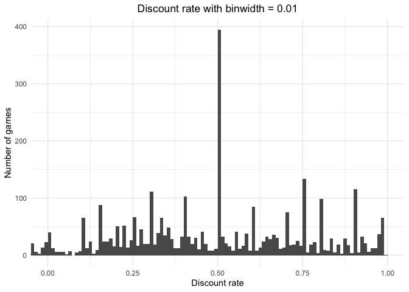

Mini Data Analysis Milestone 2
================

*To complete this milestone, you can edit [this `.rmd`
file](https://github.com/UBC-STAT/STAT545.github.io/blob/main/content/mini-data-analysis/mini-project-2.Rmd)
directly. Fill in the sections that are commented out with
`<!--- start your work here--->`. When you are done, make sure to knit
to an `.md` file by changing the output in the YAML header to
`github_document`, before submitting a tagged release on canvas.*

# Welcome to the rest of your mini data analysis project!

In Milestone 1, you explored your data. and came up with research
questions. This time, we will finish up our mini data analysis and
obtain results for your data by:

- Making summary tables and graphs
- Manipulating special data types in R: factors and/or dates and times.
- Fitting a model object to your data, and extract a result.
- Reading and writing data as separate files.

We will also explore more in depth the concept of *tidy data.*

**NOTE**: The main purpose of the mini data analysis is to integrate
what you learn in class in an analysis. Although each milestone provides
a framework for you to conduct your analysis, it’s possible that you
might find the instructions too rigid for your data set. If this is the
case, you may deviate from the instructions – just make sure you’re
demonstrating a wide range of tools and techniques taught in this class,
and indicate *why* you had to deviate. Feel free to contact the
instructor in these cases.

# Instructions

**To complete this milestone**, edit [this very `.Rmd`
file](https://github.com/UBC-STAT/STAT545.github.io/blob/main/content/mini-data-analysis/mini-project-2.Rmd)
directly. Fill in the sections that are tagged with
`<!--- start your work here--->`.

**To submit this milestone**, make sure to knit this `.Rmd` file to an
`.md` file by changing the YAML output settings from
`output: html_document` to `output: github_document`. Commit and push
all of your work to your mini-analysis GitHub repository, and tag a
release on GitHub. Then, submit a link to your tagged release on canvas.

**Points**: This milestone is worth 50 points: 45 for your analysis, and
5 for overall reproducibility, cleanliness, and coherence of the Github
submission.

**Research Questions**: In Milestone 1, you chose four research
questions to focus on. Wherever realistic, your work in this milestone
should relate to these research questions whenever we ask for
justification behind your work. In the case that some tasks in this
milestone don’t align well with one of your research questions, feel
free to discuss your results in the context of a different research
question.

# Learning Objectives

By the end of this milestone, you should:

- Understand what *tidy* data is, and how to create it using `tidyr`.
- Generate a reproducible and clear report using R Markdown.
- Manipulating special data types in R: factors and/or dates and times.
- Fitting a model object to your data, and extract a result.
- Reading and writing data as separate files.

# Setup

Begin by loading your data and the tidyverse package below:

``` r
library(datateachr) # <- might contain the data you picked!
library(tidyverse)
```

# Task 1: Process and summarize your data

From Milestone 1, you should have an idea of the basic structure of your
dataset (e.g. number of rows and columns, class types, etc.). Here, we
will start investigating your data more in-depth using various data
manipulation functions.

### 1.1 (1 point)

First, write out the 4 research questions you defined in milestone 1
were. This will guide your work through milestone 2:

<!-------------------------- Start your work below ---------------------------->

1.  *Do newer games cost more?*
2.  *How big are discounts?*
3.  *Do original and discount prices move together?*
4.  *Do achievements relate to price?*
    <!----------------------------------------------------------------------------->

Here, we will investigate your data using various data manipulation and
graphing functions.

### 1.2 (8 points)

Now, for each of your four research questions, choose one task from
options 1-4 (summarizing), and one other task from 4-8 (graphing). You
should have 2 tasks done for each research question (8 total). Make sure
it makes sense to do them! (e.g. don’t use a numerical variables for a
task that needs a categorical variable.). Comment on why each task helps
(or doesn’t!) answer the corresponding research question.

Ensure that the output of each operation is printed!

Also make sure that you’re using dplyr and ggplot2 rather than base R.
Outside of this project, you may find that you prefer using base R
functions for certain tasks, and that’s just fine! But part of this
project is for you to practice the tools we learned in class, which is
dplyr and ggplot2.

**Summarizing:**

1.  Compute the *range*, *mean*, and *two other summary statistics* of
    **one numerical variable** across the groups of **one categorical
    variable** from your data.
2.  Compute the number of observations for at least one of your
    categorical variables. Do not use the function `table()`!
3.  Create a categorical variable with 3 or more groups from an existing
    numerical variable. You can use this new variable in the other
    tasks! *An example: age in years into “child, teen, adult, senior”.*
4.  Compute the proportion and counts in each category of one
    categorical variable across the groups of another categorical
    variable from your data. Do not use the function `table()`!

**Graphing:**

6.  Create a graph of your choosing, make one of the axes logarithmic,
    and format the axes labels so that they are “pretty” or easier to
    read.
7.  Make a graph where it makes sense to customize the alpha
    transparency.

Using variables and/or tables you made in one of the “Summarizing”
tasks:

8.  Create a graph that has at least two geom layers.
9.  Create 3 histograms, with each histogram having different sized
    bins. Pick the “best” one and explain why it is the best.

Make sure it’s clear what research question you are doing each operation
for!

<!------------------------- Start your work below ----------------------------->

**Research question 1: Do newer games cost more?**

``` r
# Summarizing for research question 1: Do newer games cost more?
# Compute the price_range, mean, median, and max_price of original price across the groups of release_years.

st_games <- datateachr::steam_games %>%
  separate(release_date,
           into = c("month_day", "year"),
           sep = ",\\s*",        
           remove = FALSE) %>%
  mutate(release_year = as.integer(year)) 
```

    ## Warning: Expected 2 pieces. Additional pieces discarded in 1 rows [36325].

    ## Warning: Expected 2 pieces. Missing pieces filled with `NA` in 4745 rows [6, 16, 26, 40,
    ## 45, 58, 64, 67, 69, 75, 82, 87, 103, 106, 107, 115, 120, 134, 136, 146, ...].

    ## Warning: There was 1 warning in `mutate()`.
    ## ℹ In argument: `release_year = as.integer(year)`.
    ## Caused by warning:
    ## ! NAs introduced by coercion

``` r
# We need to separate the release_date, because data are in the form of (month_day,year).

q1_summary  <- st_games %>%
  filter(!is.na(release_year)) %>%
  group_by(release_year) %>%
  summarise(n = n(),
            price_range = max(original_price, na.rm = TRUE) - min(original_price, na.rm = TRUE),
            mean_price  = mean(original_price, na.rm = TRUE),
            median_price = median(original_price, na.rm = TRUE),
            max_price   = max(original_price, na.rm = TRUE)) %>%
arrange(desc(release_year))
```

    ## Warning: There were 6 warnings in `summarise()`.
    ## The first warning was:
    ## ℹ In argument: `price_range = max(original_price, na.rm = TRUE) -
    ##   min(original_price, na.rm = TRUE)`.
    ## ℹ In group 40: `release_year = 2021`.
    ## Caused by warning in `max()`:
    ## ! no non-missing arguments to max; returning -Inf
    ## ℹ Run `dplyr::last_dplyr_warnings()` to see the 5 remaining warnings.

``` r
q1_summary  
```

    ## # A tibble: 43 × 6
    ##    release_year     n price_range mean_price median_price max_price
    ##           <int> <int>       <dbl>      <dbl>        <dbl>     <dbl>
    ##  1         2025     1       -Inf      NaN           NA      -Inf   
    ##  2         2023     1          0        2.99         2.99      2.99
    ##  3         2022     3          0        0            0         0   
    ##  4         2021     2       -Inf      NaN           NA      -Inf   
    ##  5         2020    24         50       28.7         16.0      60.0 
    ##  6         2019  4806        625.      16.2          4.99    625.  
    ##  7         2018  9738        625.      13.2          4.99    625.  
    ##  8         2017  7279     650560      104.           4.99 650560   
    ##  9         2016  5326        598       11.6          4.99    598   
    ## 10         2015  3249        502.      12.0          4.99    502.  
    ## # ℹ 33 more rows

``` r
# Graphing for research question 1
# Make a graph where it makes sense to customize the alpha transparency.

ggplot(st_games, aes(x = release_year, y = original_price)) +
  geom_point(alpha = 0.5) +
  coord_cartesian(ylim = c(0, 700)) +
# By previous summary, we can see most of the prices are under 700, so we can zoom the y axis for a clear view.
  labs(title = "Original price vs release year",
       x = "Release year",
       y = "Original price") +
theme_minimal()+
theme(plot.title = element_text(hjust = 0.5))
```

    ## Warning: Removed 6116 rows containing missing values or values outside the scale range
    ## (`geom_point()`).

<!-- -->

**Research question 2: How big are discounts??**

``` r
# Compute the number of discounted games and the proportion.
# We need to first filter those original price that greater than 0, otherwise they couldn't be discounted.

st_games <- st_games %>%
  mutate(discount_rate = if_else(original_price > 0,(original_price - discount_price)/original_price, NA))

q2_summary <- st_games %>%
  summarise(num_discounted = sum(discount_rate > 0, na.rm = TRUE),
            num_total = sum(!is.na(discount_rate)),
            discounted_proportion = num_discounted / num_total)
q2_summary
```

    ## # A tibble: 1 × 3
    ##   num_discounted num_total discounted_proportion
    ##            <int>     <int>                 <dbl>
    ## 1           3129     12094                 0.259

``` r
# Create 3 histograms, with each histogram having different sized bins.
# Bin1 with width = 0.05
ggplot(st_games, aes(x = discount_rate)) +
  geom_histogram(binwidth = 0.05, boundary = 0) +
  coord_cartesian(xlim = c(0, 1)) +   
  labs(title = "Discount rate with binwidth = 0.05",
       x = "Discount rate", y = "Number of games") +
  theme_minimal()+
  theme(plot.title = element_text(hjust = 0.5))
```

    ## Warning: Removed 28739 rows containing non-finite outside the scale range
    ## (`stat_bin()`).

<!-- -->

``` r
# Bin1 with width = 0.025
ggplot(st_games, aes(x = discount_rate)) +
  geom_histogram(binwidth = 0.025, boundary = 0) +
  coord_cartesian(xlim = c(0, 1)) +
  labs(title = "Discount rate with binwidth = 0.025",
       x = "Discount rate", y = "Number of games") +
  theme_minimal()+
  theme(plot.title = element_text(hjust = 0.5))
```

    ## Warning: Removed 28739 rows containing non-finite outside the scale range
    ## (`stat_bin()`).

<!-- -->

``` r
# Bin1 with width = 0.01
ggplot(st_games, aes(x = discount_rate)) +
  geom_histogram(binwidth = 0.01, boundary = 0) +
  coord_cartesian(xlim = c(0, 1)) +
  labs(title = "Discount rate with binwidth = 0.01",
       x = "Discount rate", y = "Number of games") +
  theme_minimal()+
  theme(plot.title = element_text(hjust = 0.5))
```

    ## Warning: Removed 28739 rows containing non-finite outside the scale range
    ## (`stat_bin()`).

<!-- -->

**I think the best bin width would be 0.025, as it’s very clear to read
the discount rate and the columns are not that thin or fat, which
clearly shows the difference in numbers of games.**

**Research question3: Do original and discount prices move together?**

``` r
# Create a categorical variable with 3 or more groups from an existing numerical variable. 
# We can turn original_price into a price bucket.

# This idea comes from Chat-GPT, because I am confused to the difference between this research question and the previous one, but anyway, I only refer the idea, codes are written by myself.

st_games <- st_games %>%
  mutate(price_bucket = case_when(
    original_price < 10 ~ "$0–10",
    original_price < 20 ~ "$10–20",
    original_price < 50 ~ "$20–50",
    original_price < 100  ~ "$50–100",
    original_price >= 100 ~ "$100+",
    TRUE ~ NA_character_))
st_games <- st_games %>% #order the price buckets to make the data tidy
  mutate(price_bucket = factor(price_bucket,levels = c("$0–10", "$10–20", "$20–50", "$50–100", "$100+")))
q3_summary <- st_games %>%
  count(price_bucket) 
q3_summary
```

    ## # A tibble: 6 × 2
    ##   price_bucket     n
    ##   <fct>        <int>
    ## 1 $0–10        26675
    ## 2 $10–20        5424
    ## 3 $20–50        2238
    ## 4 $50–100        598
    ## 5 $100+          545
    ## 6 <NA>          5353

``` r
# Create a graph that has at least two geom layers: Columns, texts.
q3_plot <- st_games %>%
  group_by(price_bucket) %>%
  summarise(n = n(),
            median_dp = median(discount_price, na.rm = TRUE))
ggplot(q3_plot, aes(x = price_bucket, y = median_dp)) +
  geom_col(width = 0.5, fill = "grey") +                        
  geom_text(aes(label = paste0("$", format(round(median_dp, 2), ))),
            vjust = -0.5, size = 3) +  # text vjust were debugged by GPT.                           
  labs(title = "Median discounted price by original price bucket",
       x = "Original price bucket",
       y = "Median discounted price") +
theme_minimal() +
theme(plot.title = element_text(hjust = 0.5))
```

<!-- -->

**Do achievements relate to price?**

``` r
# Create a categorical variable with 3 or more groups from an existing numerical variable. 
st_games <- st_games %>%
  mutate(ach_level = case_when(achievements == 0 ~ "None (0)",
                               achievements <= 50 ~ "Low (1–50)",
                               achievements <= 100 ~ "Medium (51–100)",
                               achievements > 100 ~ "High (100+)",TRUE ~ NA_character_))
st_games <- st_games %>%
  mutate(ach_level = fct_infreq(ach_level))
q4_summary <- st_games %>%
  count(ach_level, name = "numbers of games")
q4_summary
```

    ## # A tibble: 4 × 2
    ##   ach_level       `numbers of games`
    ##   <fct>                        <int>
    ## 1 Low (1–50)                   10389
    ## 2 Medium (51–100)               1282
    ## 3 High (100+)                    523
    ## 4 <NA>                         28639

``` r
q4_plot <- st_games %>%
  group_by(ach_level) %>%
  summarise(n = n(),
            mean_op = mean(original_price, na.rm = TRUE))
ggplot(q4_plot, aes(x = ach_level, y = mean_op)) +
  geom_col(width = 0.5, fill = "grey") +                              
  geom_text(aes(label = paste0("$", format(round(mean_op, 2), big.mark=","))),
            vjust = -0.4, size = 3) +                                    
  scale_y_continuous(labels = function(x) paste0("$", format(x, big.mark=",")),
                     expand = expansion(mult = c(0, 0.10))) + # Debugged by Chat-GPT, since the old y axis was too messy
  labs(title = "Average of original price by achievement level",
       x = "Achievement level",
       y = "Average of original price") +
  theme_minimal() +
  theme(plot.title = element_text(hjust = 0.5))
```

<!-- -->

<!----------------------------------------------------------------------------->

### 1.3 (2 points)

Based on the operations that you’ve completed, how much closer are you
to answering your research questions? Think about what aspects of your
research questions remain unclear. Can your research questions be
refined, now that you’ve investigated your data a bit more? Which
research questions are yielding interesting results?

<!------------------------- Write your answer here ---------------------------->

Answer for 1.3: I think for most of my research questions, they are very
close to the answers. As I can tell that:  
For question1: When the release year updates, the game’s price tend to
rise.  
For question 2: Most of the games have a discount rate of 0.5, which is
common in the real world.  
For question 3: Original and discount prices do move together, which can
be clearly seen in q3_plot.  
For question 4: We can see prices are expensive in achievement level
(51-100).  

<!----------------------------------------------------------------------------->

# Task 2: Tidy your data

In this task, we will do several exercises to reshape our data. The goal
here is to understand how to do this reshaping with the `tidyr` package.

A reminder of the definition of *tidy* data:

- Each row is an **observation**
- Each column is a **variable**
- Each cell is a **value**

### 2.1 (2 points)

Based on the definition above, can you identify if your data is tidy or
untidy? Go through all your columns, or if you have \>8 variables, just
pick 8, and explain whether the data is untidy or tidy.

<!--------------------------- Start your work below --------------------------->

<!----------------------------------------------------------------------------->

### 2.2 (4 points)

Now, if your data is tidy, untidy it! Then, tidy it back to it’s
original state.

If your data is untidy, then tidy it! Then, untidy it back to it’s
original state.

Be sure to explain your reasoning for this task. Show us the “before”
and “after”.

<!--------------------------- Start your work below --------------------------->

<!----------------------------------------------------------------------------->

### 2.3 (4 points)

Now, you should be more familiar with your data, and also have made
progress in answering your research questions. Based on your interest,
and your analyses, pick 2 of the 4 research questions to continue your
analysis in the remaining tasks:

<!-------------------------- Start your work below ---------------------------->

1.  *FILL_THIS_IN*
2.  *FILL_THIS_IN*

<!----------------------------------------------------------------------------->

Explain your decision for choosing the above two research questions.

<!--------------------------- Start your work below --------------------------->

<!----------------------------------------------------------------------------->

Now, try to choose a version of your data that you think will be
appropriate to answer these 2 questions. Use between 4 and 8 functions
that we’ve covered so far (i.e. by filtering, cleaning, tidy’ing,
dropping irrelevant columns, etc.).

(If it makes more sense, then you can make/pick two versions of your
data, one for each research question.)

<!--------------------------- Start your work below --------------------------->

# Task 3: Modelling

## 3.0 (no points)

Pick a research question from 1.2, and pick a variable of interest
(we’ll call it “Y”) that’s relevant to the research question. Indicate
these.

<!-------------------------- Start your work below ---------------------------->

**Research Question**: FILL_THIS_IN

**Variable of interest**: FILL_THIS_IN

<!----------------------------------------------------------------------------->

## 3.1 (3 points)

Fit a model or run a hypothesis test that provides insight on this
variable with respect to the research question. Store the model object
as a variable, and print its output to screen. We’ll omit having to
justify your choice, because we don’t expect you to know about model
specifics in STAT 545.

- **Note**: It’s OK if you don’t know how these models/tests work. Here
  are some examples of things you can do here, but the sky’s the limit.

  - You could fit a model that makes predictions on Y using another
    variable, by using the `lm()` function.
  - You could test whether the mean of Y equals 0 using `t.test()`, or
    maybe the mean across two groups are different using `t.test()`, or
    maybe the mean across multiple groups are different using `anova()`
    (you may have to pivot your data for the latter two).
  - You could use `lm()` to test for significance of regression
    coefficients.

<!-------------------------- Start your work below ---------------------------->

<!----------------------------------------------------------------------------->

## 3.2 (3 points)

Produce something relevant from your fitted model: either predictions on
Y, or a single value like a regression coefficient or a p-value.

- Be sure to indicate in writing what you chose to produce.
- Your code should either output a tibble (in which case you should
  indicate the column that contains the thing you’re looking for), or
  the thing you’re looking for itself.
- Obtain your results using the `broom` package if possible. If your
  model is not compatible with the broom function you’re needing, then
  you can obtain your results by some other means, but first indicate
  which broom function is not compatible.

<!-------------------------- Start your work below ---------------------------->

<!----------------------------------------------------------------------------->

# Task 4: Reading and writing data

Get set up for this exercise by making a folder called `output` in the
top level of your project folder / repository. You’ll be saving things
there.

## 4.1 (3 points)

Take a summary table that you made from Task 1, and write it as a csv
file in your `output` folder. Use the `here::here()` function.

- **Robustness criteria**: You should be able to move your Mini Project
  repository / project folder to some other location on your computer,
  or move this very Rmd file to another location within your project
  repository / folder, and your code should still work.
- **Reproducibility criteria**: You should be able to delete the csv
  file, and remake it simply by knitting this Rmd file.

<!-------------------------- Start your work below ---------------------------->

<!----------------------------------------------------------------------------->

## 4.2 (3 points)

Write your model object from Task 3 to an R binary file (an RDS), and
load it again. Be sure to save the binary file in your `output` folder.
Use the functions `saveRDS()` and `readRDS()`.

- The same robustness and reproducibility criteria as in 4.1 apply here.

<!-------------------------- Start your work below ---------------------------->

<!----------------------------------------------------------------------------->

# Overall Reproducibility/Cleanliness/Coherence Checklist

Here are the criteria we’re looking for.

## Coherence (0.5 points)

The document should read sensibly from top to bottom, with no major
continuity errors.

The README file should still satisfy the criteria from the last
milestone, i.e. it has been updated to match the changes to the
repository made in this milestone.

## File and folder structure (1 points)

You should have at least three folders in the top level of your
repository: one for each milestone, and one output folder. If there are
any other folders, these are explained in the main README.

Each milestone document is contained in its respective folder, and
nowhere else.

Every level-1 folder (that is, the ones stored in the top level, like
“Milestone1” and “output”) has a `README` file, explaining in a sentence
or two what is in the folder, in plain language (it’s enough to say
something like “This folder contains the source for Milestone 1”).

## Output (1 point)

All output is recent and relevant:

- All Rmd files have been `knit`ted to their output md files.
- All knitted md files are viewable without errors on Github. Examples
  of errors: Missing plots, “Sorry about that, but we can’t show files
  that are this big right now” messages, error messages from broken R
  code
- All of these output files are up-to-date – that is, they haven’t
  fallen behind after the source (Rmd) files have been updated.
- There should be no relic output files. For example, if you were
  knitting an Rmd to html, but then changed the output to be only a
  markdown file, then the html file is a relic and should be deleted.

Our recommendation: delete all output files, and re-knit each
milestone’s Rmd file, so that everything is up to date and relevant.

## Tagged release (0.5 point)

You’ve tagged a release for Milestone 2.
